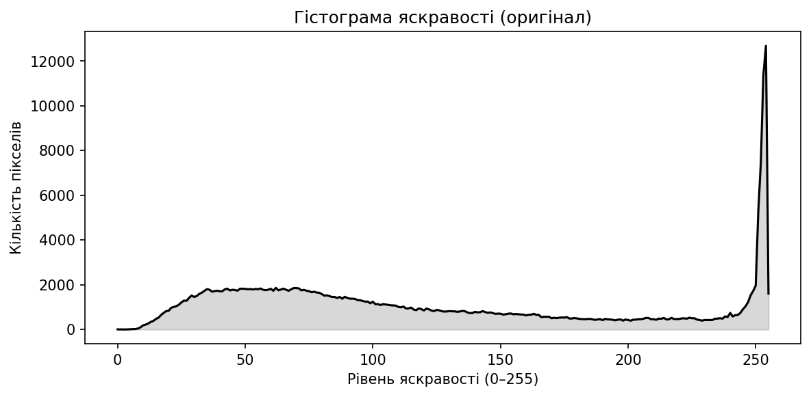

# Лабораторна робота №1

## Тема

Базова обробка цифрового зображення: перетворення до відтінків сірого, негатив, лінійне контрастування, аналіз гістограми яскравості.

## Мета

Ознайомитися з завантаженням зображення за допомогою OpenCV, виконати прості точкові перетворення яскравості та оцінити розподіл яскравості за гістограмою.

## Короткі теоретичні відомості

- **Сірий рівень:** кожному пікселю відповідає одна інтенсивність у діапазоні \([0, 255]\) (8 біт на піксель).
- **Негатив (інверсія):** \(g = 255 - f\), де \(f\) — вхідна яскравість, \(g\) — вихідна; темні ділянки стають світлішими і навпаки.
- **Лінійне контрастування (розтягування динамічного діапазону):** лінійне відображення мінімальної та максимальної яскравості зображення на повний діапазон \([0, 255]\), що підсилює візуальний контраст, якщо гістограма була «вузькою».
- **Гістограма яскравості:** графік \(h(k)\) — кількість пікселів з рівнем яскравості \(k\); дозволяє судити про експозицію, контраст і домінуючі тони.

## Опис виконання

1. Використано вхідне зображення `satir.jpg` з кореня репозиторію.
2. Завантаження виконано у режимі відтінків сірого; для сумісності зі шляхами Windows з не-ASCII символами застосовано читання через `numpy.fromfile` та `cv2.imdecode` (див. `Lab_01.ipynb`).
3. Побудовано негатив і нормалізоване за мінімумом/максимумом зображення (`cv2.normalize` з `NORM_MINMAX`).
4. Обчислено гістограму (`cv2.calcHist`) і збережено графік у файл.
5. Усі результати збережено у `Lab_01/results/`.

Виконання ноутбука `Lab_01.ipynb` у Jupyter (JupyterLab, VS Code/Cursor або класичний Notebook): відкрити файл і виконати комірки послідовно (або **Run All**). Попередній перегляд зображень — у ноутбуку; файли для звіту формуються у `results/`.

## Результати

### Оригінал (сірий рівень)

### Негатив

### Лінійне контрастування

### Гістограма яскравості (оригінал)

## Інтерпретація отриманих результатів

- **Оригінал** демонструє початковий розподіл тонів тестового зображення.
- **Негатив** зберігає деталі, але інвертує сприйняття освітленості; корисний для швидкої візуальної перевірки та деяких задач аналізу.
- **Лінійне контрастування** розтягує використаний діапазон яскравості на \([0, 255]\), тому зображення зазвичай виглядає контрастнішим, якщо початковий діапазон був вужчим за повний.
- **Гістограма** показує, які рівні яскравості зустрічаються найчастіше; за формою гістограми можна оцінити, чи зображення переважно темне, світле або збалансоване.

## Висновки

Освоєно базовий цикл: завантаження зображення, точкові перетворення яскравості, обчислення та візуалізація гістограми. Отримані файли придатні для включення у звіт у форматі Markdown.

## Відповіді на контрольні питання

1. **Що таке точкове перетворення яскравості?**  
   Це перетворення, у якому нова яскравість пікселя залежить лише від його старої яскравості, а не від сусідів (наприклад, негатив або гамма-корекція).

2. **Як отримати негатив для 8-бітного зображення?**  
   Застосувати формулу \(g = 255 - f\) для кожного пікселя.

3. **Навіщо використовують гістограму яскравості?**  
   Щоб побачити розподіл інтенсивностей, оцінити контраст, виявити «затискання» у тінях або світлах і обґрунтувати подальші кроки підсилення або вирівнювання.

4. **Чим лінійне контрастування відрізняється від простого зсуву яскравості?**  
   Лінійне контрастування масштабує діапазон \([f_{\min}, f_{\max}]\) на \([0, 255]\), тобто змінює і нахил, і положення характеристики; простий зсув додає константу до всіх рівнів без масштабування діапазону.
