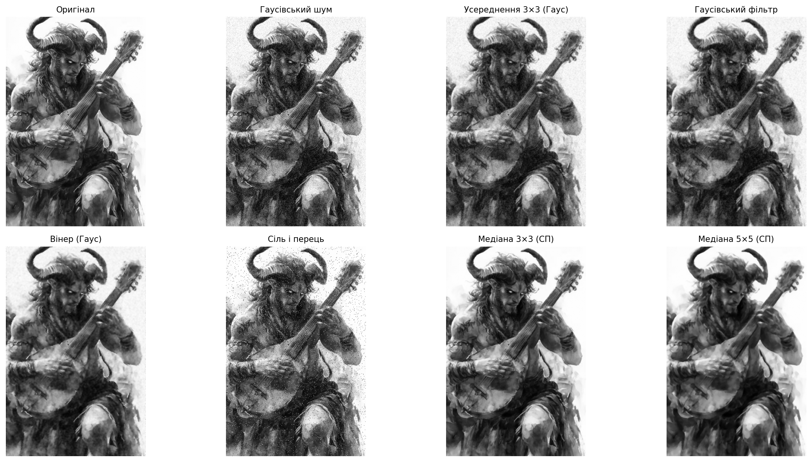

# Лабораторна робота №2

## Тема

Фільтрація й придушення шумів

## Мета роботи

Дослідити вплив різних типів шумів на цифрове зображення та порівняти ефективність різних методів фільтрації.

## Теоретичні відомості

**Шум на цифровому зображенні** — випадкові або нерегулярні відхилення значень пікселів від «істинного» сигналу, що виникають на етапах знімання, передачі або оцифрування. Шум погіршує візуальну якість і ускладнює подальшу обробку (сегментацію, розпізнавання тощо).

**Гаусівський шум** моделюється як додавання до кожного пікселя випадкової величини з нормального розподілу. На зображенні він виглядає як рівномірна зернистість по всьому полю; великі значення дисперсії роблять деталі менш чіткими.

**Імпульсний шум «сіль і перець»** — частина пікселів спотворюється до максимальної (білі «крапки солі») або мінімальної (чорні «крапки перцю») яскравості. Такий шум локалізований і різко відрізняється від сусідів.

**Фільтрація зображення** — просторова обробка, при якій нове значення пікселя обчислюється з значень у його околіці (вікні). Мета — придушити шум, зберігаючи по можливості корисні деталі та границі.

**Усереднювальний фільтр** замінює значення пікселя середнім арифметичним у прямокутному вікні. Він згладжує випадкові відхилення, але розмиває різкі перепади яскравості (контури, дрібний текст).

**Гаусівський фільтр** — згортка з ядром, ваги якого відповідають двовимірній функції Гауса; сусіди ближче до центру вікна мають більший вплив. Зазвичай він м’якше за рівномірне усереднення того ж розміру зменшує шум і менше «рве» структуру.

**Медіанний фільтр** замінює значення пікселя **медіаною** у вікні. Медіана стійка до одиничних викидів, тому фільтр ефективно прибирає імпульсний шум «сіль і перець» і краще зберігає різкі границі, ніж просте усереднення.

**Вінерівський фільтр** (у наближенні, реалізованому в `scipy.signal.wiener`) оцінює локальні статистичні властивості сигналу та шуму й намагається оптимально (у середньоквадратичному сенсі) відновити зображення. Для гаусівського шну він часто дає згладжування з кращим збереженням деталей, ніж наївне усереднення, хоча результат залежить від розміру вікна `mysize` та оцінки шуму.

## Хід роботи

1. У середовищі Jupyter відкрити `Lab_02.ipynb` і виконати комірки послідовно (або **Run All**).
2. Імпортовано бібліотеки: `pathlib`, `numpy`, `cv2`, `matplotlib.pyplot`, `scipy.signal` (використання `scipy.signal.wiener`).
3. Налаштовано шляхи: `NOTEBOOK_DIR`, `ROOT`, `IMAGE_PATH` (`satir.jpg` у корені репозиторію), `RESULTS_DIR` (`Lab_02/results/`); передбачено коректну роботу як при запуску з папки `Lab_02`, так і при виконанні з кореня репозиторію.
4. Завантажено `satir.jpg` у градаціях сірого через `imread_gray_unicode`; збережено `original_gray.png`.
5. Змодельовано **гаусівський шум** функцією `add_gaussian_noise`; збережено `gaussian_noise.png`.
6. Змодельовано шум **«сіль і перець»** функцією `add_salt_pepper_noise`; збережено `salt_pepper_noise.png`.
7. Для зображення з гаусівським шумом застосовано усереднення 3×3 та 5×5, гаусівський фільтр 5×5 та вінерівський фільтр; збережено відповідні PNG.
8. Для зображення з шумом «сіль і перець» застосовано медіанні фільтри 3×3 і 5×5 та усереднення 5×5 для порівняння; збережено результати.
9. Побудовано зведену фігуру `comparison.png` з вісьмома панелями для наочного порівняння.

## Результати

Файл `average_salt_pepper.png` (усереднення 5×5 після шуму «сіль і перець») також згенеровано ноутбуком для порівняння з медіаною; його можна переглянути у папці `results/`.

## Інтерпретація результатів

Гаусівський шум проявляється як випадкові дрібні зміни яскравості по всьому зображенню; деталі «підсипані» зернистістю, але форма великих об’єктів зазвичай залишається впізнаваною.

Усереднювальні фільтри згладжують гаусівський шум, але одночасно **розмивають** дрібні деталі та контури. Фільтр **5×5** дає сильніше згладжування, ніж **3×3**, тому зображення виглядає м’якшим, але **різкість** знижується більше.

Гаусівський фільтр працює **м’якше**, ніж рівномірне усереднення того ж розміру, оскільки ваги зменшуються до країв вікна; шум зменшується з меншим «плаваючим» розмиттям границь.

Вінерівський фільтр враховує **локальні** статистичні властивості й зазвичай краще балансує між придушенням шуму та збереженням структури, ніж просте усереднення (конкретний вигляд залежить від параметрів).

Шум «сіль і перець» найкраще прибирається **медіанним** фільтром: медіана ігнорує окремі екстремальні значення в вікні, тому білі та чорні імпульси зникають, тоді як усереднення лише **розмазує** імпульс по сусідах і залишає помітні артефакти.

Медіанний фільтр **краще зберігає границі**, ніж просте усереднення, оскільки не зміщує рівень яскравості всього ребра до середнього значення сусідів так агресивно, як усереднювальне ядро.

## Висновки

У ході лабораторної роботи було досліджено вплив гаусівського та імпульсного шуму на цифрове зображення. Було реалізовано кілька методів фільтрації: усереднювальний, гаусівський, медіанний та вінерівський. Встановлено, що для гаусівського шуму ефективними є згладжувальні фільтри, однак вони можуть зменшувати різкість зображення. Для імпульсного шуму типу «сіль і перець» найкращий результат показав медіанний фільтр, оскільки він замінює значення пікселя медіаною локального вікна та добре усуває окремі чорні й білі точки.

## Контрольні питання

1. **Що таке шум на цифровому зображенні?**  
   Це випадкові або нерегулярні спотворення значень пікселів відносно ідеального сигналу, що з’являються через фізичні обмеження сенсора, квантування, передачу даних тощо.

2. **Які типи шумів були використані в роботі?**  
   Гаусівський (адитивний нормальний) шум і імпульсний шум «сіль і перець».

3. **Чим відрізняється гаусівський шум від шуму «сіль і перець»?**  
   Гаусівський шум змінює майже всі пікселі на невеличку випадкову величину (зернистість по полю). «Сіль і перець» змінює лише частину пікселів до екстремальних значень 0 або 255, створюючи рідкісні імпульси.

4. **Що таке фільтрація зображення?**  
   Це просторова обробка, у якій нове значення пікселя обчислюється з пікселів його локальної околиці з метою придушення шуму або виділення ознак.

5. **Який фільтр краще підходить для імпульсного шуму?**  
   Медіанний фільтр (як правило, ефективніший за усереднення для «солі-перцю»).

6. **Чому медіанний фільтр добре усуває шум «сіль і перець»?**  
   Бо медіана в окні не залежить від одиничних екстремальних значень: якщо більшість сусідів мають типові рівні, викид 0 або 255 не зміщує медіану так, як середнє.

7. **Який недолік мають усереднювальні фільтри?**  
   Вони розмивають різкі перепади яскравості та дрібні деталі; на імпульсному шумі можуть «розмазувати» крапки солі/перцю замість їхнього повного усунення.

8. **У чому суть вінерівської фільтрації?**  
   У статистично обґрунтованому відновленні сигналу з урахуванням моделі шуму (наближене до мінімізації середньоквадратичної похибки між оцінкою та істинним зображенням у припущеннях, на яких базується використаний алгоритм).
