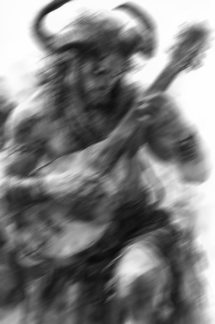
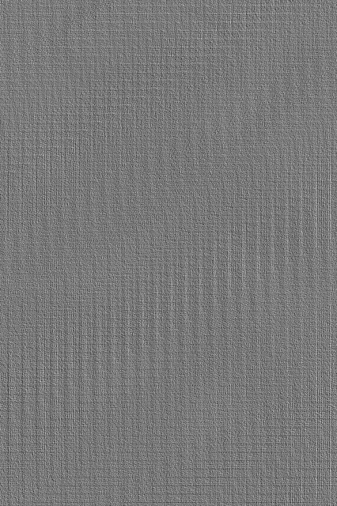
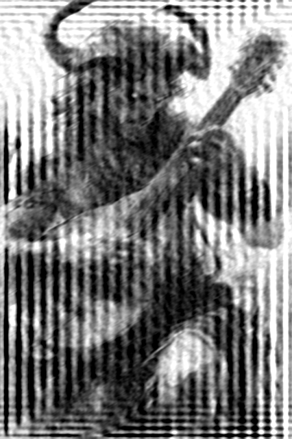
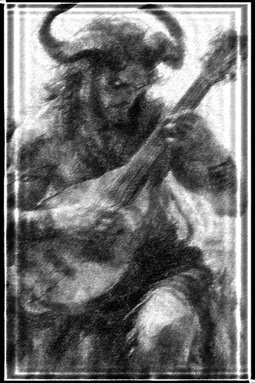
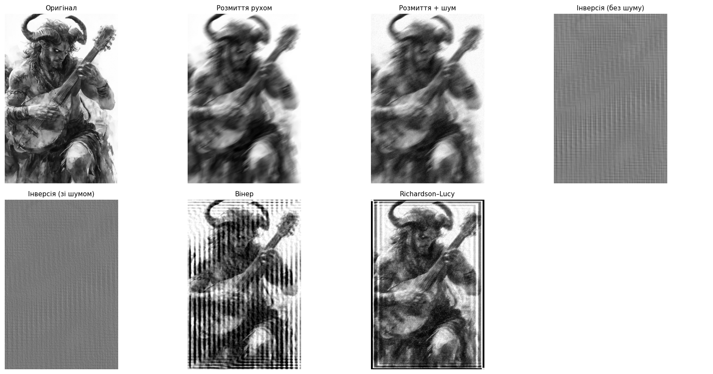

# Лабораторна робота №3

## Тема

Відновлення зображень

## Мета роботи

Дослідити методи відновлення цифрових зображень після спотворення розмиттям та шумом.

## Теоретичні відомості

**Відновлення зображення** — процес оцінювання початкового сигналу \(f(x, y)\) за спостережуваним спотвореним зображенням \(g(x, y)\), коли відома або оцінена модель спотворення (зокрема PSF \(h(x, y)\)).

**Чим відновлення відрізняється від покращення:** «покращення» часто означає загальні евристики (контраст, різкість, локальне підсилення) без явної інверсії конкретного спотворення. **Відновлення** спирається на **модель** спотворення й намагається компенсувати її (наприклад, деконволюція з відомим ядром).

**Модель спотворення зображення** (лінійна згортка з адитивним шумом):

\[
g(x, y) = h(x, y) * f(x, y) + n(x, y)
\]

де:

- \(f(x, y)\) — початкове зображення;
- \(h(x, y)\) — функція розсіювання точки (**PSF**);
- \(n(x, y)\) — шум;
- \(g(x, y)\) — спотворене зображення;
- \(*\) — операція **згортки** (2D convolution).

**PSF (Point Spread Function)** — відгук оптичної або обчислювальної системи на точкове джерело; у дискретному вигляді це матриця (ядро), з якою згортається оригінал.

**Розмиття рухом** — PSF має вигляд витягнутого сегмента (сліду руху камери або об’єкта); у лабораторній роботі воно моделюється поворотом горизонтальної лінії в матриці ядра.

**Інверсна фільтрація** у частотній області відповідає поділу спектрів \(\mathcal{F}(g) / \mathcal{F}(h)\) (із регуляризацією, щоб уникнути ділення на нуль). У просторі це наближення до **оберненої згортки**. При **ідеальній** моделі й **відсутності шуму** можна відновити \(f\); на практиці межі кадру та дискретизація дають артефакти.

**Проблема підсилення шуму при інверсній фільтрації:** у спектрі шуму є енергія на високих частотах, де \(|H|\) часто мале. Ділення на малі значення \(H\) **підсилює** ці компоненти, тому зображення покривається зерном і структурними артефактами.

**Вінерівська фільтрація** вводить стабілізацію: замість «чистого» ділення використовується оцінка, що враховує співвідношення потужності сигналу й шуму (у `skimage.restoration.wiener` — через параметр `balance`), що зменшує неконтрольоване підсилення шуму.

**Richardson–Lucy деконволюція** — ітеративний алгоритм, що максимізує правдоподібність за моделлю згортки (часто застосовують і при наближенні до гаусівського шуму). Він може покращувати різкість, але при великій кількості ітерацій може підсилювати кільця та шумові артефакти.

## Хід роботи

1. Відкрити `Lab_03.ipynb` і виконати комірки (або `jupyter nbconvert --execute ... --inplace` з кореня репозиторію).
2. Завантажено `satir.jpg` у градаціях сірого; збережено `original_gray.png`.
3. Побудовано PSF **розмиття рухом** (`motion_blur_kernel`) і застосовано `cv2.filter2D` → `motion_blur.png`.
4. Додано **гаусівський шум** (`add_gaussian_noise`, \(\sigma=10\)) → `motion_blur_noise.png`.
5. Реалізовано **інверсну фільтрацію** у частотній області (`inverse_filter` з регуляризацією `eps`) для зображення без додаткового шуму (`motion_blur.png`) та зі шумом (`motion_blur_noise.png`) → `inverse_restored.png`, `inverse_restored_noisy.png`.
6. Застосовано **вінерівське** відновлення `skimage.restoration.wiener` до `motion_blur_noise.png` (нормалізація [0, 1], PSF у `float`) → `wiener_restored.png`.
7. Застосовано **Richardson–Lucy** `skimage.restoration.richardson_lucy` з `num_iter=30` (fallback на `iterations` за потреби) → `richardson_lucy_restored.png`.
8. Побудовано порівняльну фігуру `comparison.png` (сітка 2×4, остання комірка порожня).
9. Виконано перевірку наявності усіх файлів у `results/`.

## Результати

## Інтерпретація результатів

Після застосування ядра розмиття рухом контури зображення стали менш чіткими: високочастотна енергія зменшилася, деталі «розмазані» вздовж напрямку PSF.

Додавання гаусівського шуму ще більше погіршило якість: з’явилася зернистість, яка накладається на вже розмите зображення.

Інверсна фільтрація **частково відновлює** різкість на зображенні **без** додаткового шуму, проте через циклічну природу FFT та крайові умови можливі артефакти на межах кадру.

За наявності шуму інверсна фільтрація **підсилює шумові компоненти** (типовий ефект «вибуху» високих частот), тому візуальна якість різко падає.

Вінерівський метод дає **стабільніший** результат, оскільки обмежує підсилення там, де модель вважає шум відносно сильним (через `balance` та вбудовану логіку стабілізації).

Richardson–Lucy може **підвищувати різкість** і краще відновлювати локальну структуру, але при великій кількості ітерацій може з’являтися підсилення артефактів і кілець навколо контурів.

Найкращий результат **залежить** від рівня шуму, точності знання PSF, параметрів регуляризації (`eps`, `balance`) та числа ітерацій RL.

## Висновки

У ході лабораторної роботи було досліджено методи відновлення цифрових зображень після спотворення розмиттям рухом та шумом. Було створено модель спотворення з використанням PSF, після чого застосовано інверсну фільтрацію, вінерівське відновлення та метод Richardson–Lucy. Встановлено, що інверсна фільтрація може частково відновити зображення без шуму, однак є дуже чутливою до шумових компонентів. Вінерівський метод показав стабільніший результат при наявності шуму, оскільки враховує співвідношення між корисним сигналом і шумом. Метод Richardson–Lucy дозволяє підвищити різкість, але потребує обережного вибору кількості ітерацій.

## Контрольні питання

1. **Що таке відновлення зображення?**  
   Це оцінювання початкового зображення за спотвореним спостереженням з використанням моделі спотворення (наприклад, згортки з PSF і шуму).

2. **Чим відновлення зображення відрізняється від покращення?**  
   Відновлення орієнтоване на **інверсію відомого або оціненого** спотворення; покращення часто є загальними операціями без явної фізичної моделі.

3. **Що таке PSF?**  
   Point Spread Function — ядро, що описує, як точка на сцені відображається в пікселях (розмиття оптики/сенсора/руху).

4. **Якою математичною моделлю описується спотворення зображення?**  
   \(g = h * f + n\) — згортка з PSF плюс адитивний шум.

5. **У чому полягає інверсна фільтрація?**  
   У компенсації згортки в частотній області через ділення спектрів (з регуляризацією) або еквівалентних операцій у просторі.

6. **Чому інверсна фільтрація чутлива до шуму?**  
   Бо ділення на малі значення передаточної функції підсилює високі частоти, де енергія шуму відчутна.

7. **У чому суть вінерівського відновлення?**  
   У стабілізованій оцінці сигналу з урахуванням шуму (компроміс між відновленням деталей і придушенням шуму).

8. **Для чого використовується Richardson–Lucy деконволюція?**  
   Для ітеративної деконволюції при моделі згортки, зокрема коли потрібно покращити різкість при відомому PSF.

9. **Чому при відновленні важливо знати або оцінити PSF?**  
   Бо помилкове ядро дає неправильну «інверсію» і сильні артефакти; навіть правильний метод не відновить \(f\), якщо \(h\) неточний.

10. **Які артефакти можуть виникати під час відновлення зображення?**  
    Кільця біля контурів, зерно, підсилення шуму, крайові ефекти (через FFT/межі кадру), перекос яскравості, «перегрів» ітерацій у RL.
