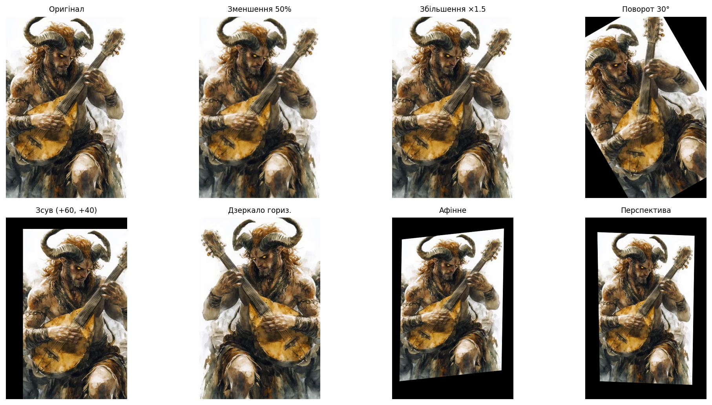
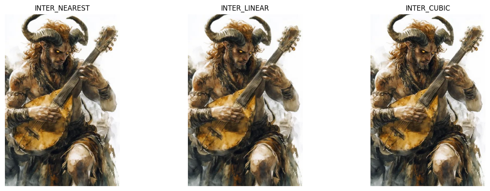

# Лабораторна робота №4

## Тема

Просторові перетворення зображень

## Мета роботи

Дослідити основні просторові перетворення цифрових зображень: масштабування, поворот, зсув, віддзеркалення, афінне та перспективне перетворення, а також порівняти методи інтерполяції при зміні розміру.

## Теоретичні відомості

**Просторове перетворення** — відображення координат пікселів вихідного зображення \((x, y)\) у координати цільового зображення \((x', y')\) (або навпаки, залежно від постановки). Для дискретної сітки нові координати зазвичай не збігаються з цілими вузлами, тому потрібна **інтерполяція** значень яскравості/кольору.

**Масштабування** змінює лінійні розміри зображення: кожна координата множиться на коефіцієнт (різні коефіцієнти для \(x\) та \(y\) дають незалежне розтягнення по осях). У матричному вигляді для однорідних координат:

\[
\begin{bmatrix} x' \\ y' \end{bmatrix}
=
\begin{bmatrix} s_x & 0 \\ 0 & s_y \end{bmatrix}
\begin{bmatrix} x \\ y \end{bmatrix}.
\]

**Поворот** на кут \(\theta\) навколо початку координат:

\[
\begin{bmatrix} x' \\ y' \end{bmatrix}
=
\begin{bmatrix}
\cos\theta & -\sin\theta \\
\sin\theta & \cos\theta
\end{bmatrix}
\begin{bmatrix} x \\ y \end{bmatrix}.
\]

Навколо довільної точки \((c_x, c_y)\) спочатку переносять початок у центр обертання, застосовують поворот, потім повертають зсув.

**Зсув** (translation) на вектор \((t_x, t_y)\):

```text
x' = x + tx
y' = y + ty
```

У афінній матриці \(2 \times 3\) (як у OpenCV `warpAffine`): \([x', y']^\top = M [x, y, 1]^\top\).

**Віддзеркалення** — симетрія відносно вертикальної або горизонтальної осі; відповідає зміні знака однієї з координат (або обміну з додатковими зсувами для збереження полотна).

**Афінне перетворення** зберігає паралельність прямих і співвідношення відстаней на паралельних прямих. У 2D в однорідних координатах:

\[
\begin{bmatrix} x' \\ y' \\ 1 \end{bmatrix}
\sim
\begin{bmatrix}
a_{11} & a_{12} & a_{13} \\
a_{21} & a_{22} & a_{23} \\
0 & 0 & 1
\end{bmatrix}
\begin{bmatrix} x \\ y \\ 1 \end{bmatrix}.
\]

Три пари відповідних точок однозначно задають афінне перетворення на площині (`getAffineTransform`).

**Перспективне (проективне) перетворення** задається матрицею \(3 \times 3\) з 8 незалежними параметрами (з точністю до масштабу): прямі лінії переходять у прямі, але паралельність, загалом, не зберігається. Чотири пари точок дозволяють обчислити гомографію (`getPerspectiveTransform` + `warpPerspective`).

**Інтерполяція** при `resize` визначає, як обчислити значення у нецілій позиції з сусідніх пікселів.

- **Nearest (найближчий сусід)** — береться значення найближчого пікселя; швидко, але помітні «сходинки» та aliasing.
- **Bilinear (лінійна)** — зважене усереднення по чотирьох сусідах; компроміс між якістю та швидкістю.
- **Bicubic (кубічна)** — використовує більшу околицю (16 пікселів для сепарабельного bicubic); плавніші переходи, повільніше.

## Опис виконання

1. У `Lab_04.ipynb` імпортовано `pathlib`, `numpy`, `cv2`, `matplotlib.pyplot`.
2. Налаштовано `NOTEBOOK_DIR`, `ROOT`, `IMAGE_PATH`, `RESULTS_DIR` з підтримкою запуску з кореня репозиторію або з папки `Lab_04`.
3. Реалізовано `imread_color_unicode`, `imread_gray_unicode`, `imwrite_unicode` для коректної роботи з Unicode-шляхами у Windows.
4. Завантажено `satir.jpg` у кольорі та у градаціях сірого; збережено `original_color.png`, `original_gray.png`.
5. Виконано масштабування до 50% та ×1.5 (`cv2.resize`); збережено `scaled_down.png`, `scaled_up.png`.
6. Поворот на 30° навколо центра через `getRotationMatrix2D` та `warpAffine`; `rotated_30.png`.
7. Зсув матрицею `[[1,0,60],[0,1,40]]`; `translated.png`.
8. Горизонтальне та вертикальне віддзеркалення (`cv2.flip`); `flipped_horizontal.png`, `flipped_vertical.png`.
9. Афінне перетворення з трьома автоматично обраними точками; `affine_transform.png`.
10. Перспективне перетворення з чотирма точками; `perspective_transform.png`.
11. Збільшення у 2 рази з `INTER_NEAREST`, `INTER_LINEAR`, `INTER_CUBIC`; відповідні PNG у `results/`.
12. Зібрано сітку 2×4 у `comparison.png` та три методи інтерполяції у `interpolation_comparison.png`.
13. Фінальна комірка перевіряє наявність усіх 15 файлів і виводить повідомлення про успіх.

## Результати

Усі зображення знаходяться у папці [`Lab_04/results/`](results/):

| Файл | Зміст |
|------|--------|
| `original_color.png` | Вхідне зображення (колір) |
| `original_gray.png` | Вхідне зображення (сірий рівень) |
| `scaled_down.png` | Зменшення до 50% |
| `scaled_up.png` | Збільшення ×1.5 |
| `rotated_30.png` | Поворот 30° |
| `translated.png` | Зсув +60 px по \(x\), +40 px по \(y\) |
| `flipped_horizontal.png` | Горизонтальне дзеркало |
| `flipped_vertical.png` | Вертикальне дзеркало |
| `affine_transform.png` | Афінне перетворення |
| `perspective_transform.png` | Перспективне перетворення |
| `interpolation_nearest.png` | Збільшення ×2, nearest |
| `interpolation_linear.png` | Збільшення ×2, linear |
| `interpolation_cubic.png` | Збільшення ×2, cubic |
| `comparison.png` | Порівняння основних операцій (2×4) |
| `interpolation_comparison.png` | Порівняння інтерполяцій |

Приклади збережених композицій:





## Інтерпретація отриманих результатів

- **Масштабування:** при зменшенні краще використовувати `INTER_AREA` (згладжує aliasing); при збільшенні — `INTER_LINEAR` або `INTER_CUBIC` для меншої «блочності», ніж у nearest.
- **Поворот і зсув:** на краях з’являються чорні області через `BORDER_CONSTANT` — це очікувано, бо частина пікселів виходить за межі полотна.
- **Афінне та перспективне** перетворення змінюють геометрію сцени; перспектива сильніше «ламає» паралельність горизонталей (на кшталт ефекту наклону площини до камери).
- **Інтерполяція:** на різких краях nearest дає ступінчасті артефакти; cubic зазвичай виглядає найм’якіше, але може вносити легкі ореоли біля контрастних меж.

## Висновки

Опановано базові просторові операції OpenCV над растровим зображенням `satir.jpg`: геометричні перетворення реалізуються через матриці та функції `warpAffine` / `warpPerspective`, а якість масштабування залежить від обраного методу інтерполяції. Unicode-шляхи на Windows обробляються через `imdecode` / `imencode` з буфером файлу.

## Відповіді на контрольні питання

1. **Чим афінне перетворення відрізняється від перспективного?** Афінне зберігає паралельність прямих; перспективне зберігає лише відображення прямих на прямі, тому паралельні лінії на площині можуть зійтися в одній точці (vanishing point).
2. **Навіщо потрібна інтерполяція при `resize`?** Нові координати пікселів, як правило, дробові; потрібно оцінити значення сигналу між дискретними вузлами сітки.
3. **Коли доцільно використовувати `INTER_NEAREST`?** Коли важлива швидкість або потрібно зберегти різкі межі без згладжування (рідко для природних фото; частіше для масок або індексованих карт).
