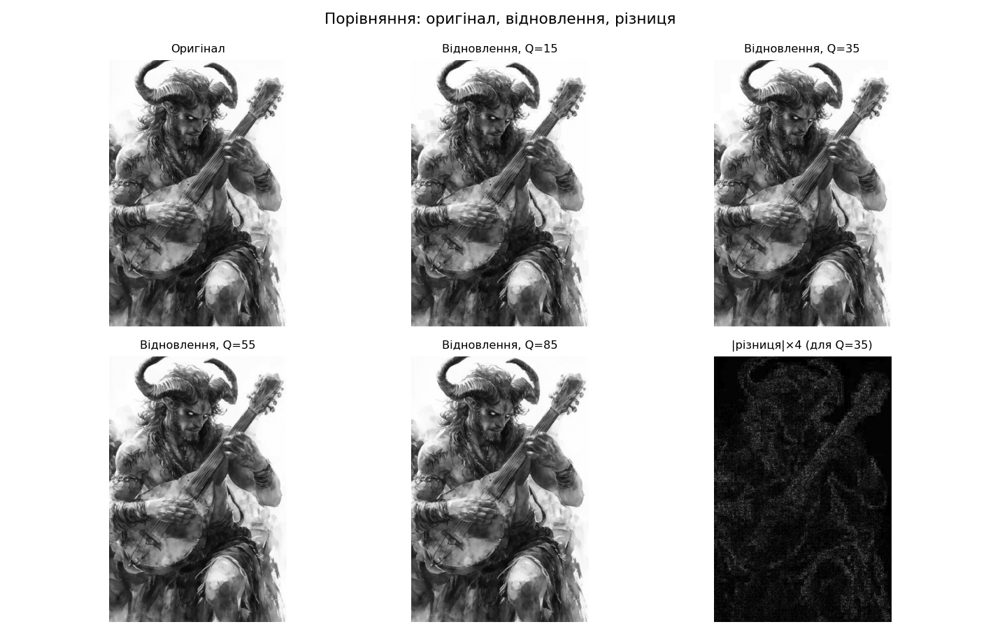
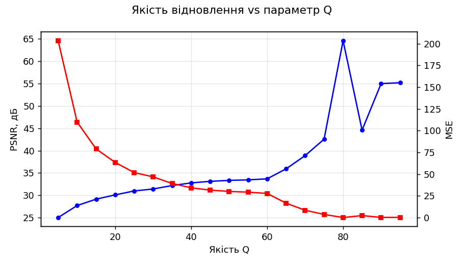

# Лабораторна робота №5

## Тема

Стиснення зображень

## Мета роботи

Дослідити принципи стиснення цифрових зображень на основі дискретного косинусного перетворення, квантування коефіцієнтів та оцінки якості відновлення.

## Теоретичні відомості

**Стиснення зображень** — зменшення обсягу даних, необхідних для зберігання або передачі растрового зображення. Розрізняють стиснення **без втрат** (інформація відновлюється точно) та **з втратами** (допускається невідновлювана втрата інформації за рахунок меншого розміру файлу або вищого ступеня стиснення).

**Дискретне косинусне перетворення (DCT)** для блоку пікселів перетворює сигнал з просторової області в область **частот**. Низькочастотні коефіцієнти зазвичай мають більшу амплітуду й відповідають плавним змінам яскравості; високочастотні — дрібним деталям і шуму. Двовимірне DCT-II по блоку \(8 \times 8\) зазвичай обчислюють як послідовність одновимірних DCT по рядках і стовпцях (роздільне перетворення).

**Квантування** — ділення коефіцієнтів DCT на елементи **матриці квантування** з наступним округленням до цілих. Це головне джерело **втрат** у JPEG-подібних схемах: дрібні коефіцієнти обнуляються або спрощуються. Чим більші кроки квантування (що відповідає нижчій «якості» \(Q\) у масштабуванні стандартної таблиці), тим агресивніше відкидаються високі частоти.

**Відновлення:** зворотне множення на ту саму матрицю квантування (де-квантування), **IDCT**, зсув рівнів яскравості назад (у JPEG для сірого каналу типово зсув на \(\pm 128\)).

**Оцінка якості:**

- **MSE** (середня квадратична помилка): \(\mathrm{MSE} = \frac{1}{MN}\sum_{i,j}(I_{ij} - \hat{I}_{ij})^2\).
- **PSNR** (пікове відношення сигнал/шум): \(\mathrm{PSNR} = 10\log_{10}\frac{MAX^2}{\mathrm{MSE}}\), де для 8-біт \(MAX = 255\). Чим вищий PSNR (у дБ), тим ближче відновлене зображення до оригіналу.

Повний JPEG додатково використовує **RLE** та **код Хаффмана** по серійно впорядкованих коефіцієнтах; у даній лабораторній реалізовано **блокове DCT + квантування + IDCT** без ентропійного кодування, що достатньо для демонстрації візуальних втрат і залежності PSNR від \(Q\).

## Опис виконання

1. Імпортовано `pathlib`, `numpy`, `cv2`, `matplotlib.pyplot`, `scipy.fftpack.dct`, `scipy.fftpack.idct`.
2. Налаштовано `NOTEBOOK_DIR`, `ROOT`, `IMAGE_PATH`, `RESULTS_DIR` з підтримкою запуску з кореня репозиторію або з `Lab_05`.
3. Реалізовано `imread_gray_unicode` та `imwrite_unicode` для Unicode-шляхів у Windows.
4. Завантажено `satir.jpg` у градаціях сірого; збережено `original_gray.png`.
5. Реалізовано `dct2` та `idct2` з `norm="ortho"` згідно з методичними вимогами.
6. Застосовано JPEG-подібну матрицю квантування яскравості, масштабовану параметром якості \(Q\); для кожного блоку \(8 \times 8\) виконано DCT, квантування, де-квантування та IDCT; зображення доповнено до кратного 8.
7. Обчислено MSE та PSNR для ряду значень \(Q\); збережено відновлені зображення для \(Q \in \{15, 35, 55, 85\}\), графік PSNR/MSE, спектр DCT першого блоку, масштабовану карту абсолютної різниці та порівняльну сітку `comparison_reconstructions.png`.
8. Фінальна комірка перевіряє наявність усіх очікуваних файлів у `results/`.

## Результати

Файли у папці [`Lab_05/results/`](results/):

| Файл | Опис |
|------|------|
| `original_gray.png` | Вхідне зображення (сірий рівень) |
| `reconstructed_q15.png` | Відновлення при низькій якості \(Q=15\) |
| `reconstructed_q35.png` | Відновлення при \(Q=35\) |
| `reconstructed_q55.png` | Відновлення при \(Q=55\) |
| `reconstructed_q85.png` | Відновлення при високій якості \(Q=85\) |
| `difference_abs_scaled.png` | Візуалізація \(|I-\hat{I}|\) (масштаб ×4) для \(Q=35\) |
| `dct_spectrum_first_block.png` | \(\log(1+|c|)\) коефіцієнтів DCT першого блоку |
| `psnr_mse_vs_quality.png` | Залежність PSNR та MSE від \(Q\) |
| `comparison_reconstructions.png` | Сітка 2×3: оригінал, чотири \(Q\), різниця |

## Інтерпретація отриманих результатів

При **низькому** \(Q\) матриця квантування масштабується так, що кроки стають великими: більше високочастотних коефіцієнтів обнуляється після округлення — зображення **розмитіше**, з’являються **блочні артефакти** на межах \(8 \times 8\), **PSNR нижчий**, **MSE вищий**. При **високому** \(Q\) квантування м’якше, відновлення ближче до оригіналу; при \(Q \to 100\) втрати мінімальні (на практиці обмежені точністю числа з плаваючою комою та округленнями).

Карта різниці показує, де найбільше змінюються яскравості після стиснення (зазвичай різкі контури та текстура).

## Висновки

Блокове DCT з квантуванням коефіцієнтів демонструє типову схему **стиснення з втратами**: керування якістю через параметр \(Q\) дозволяє балансувати між розміром «складності» коефіцієнтів (у повній системі — бітрейтом після ентропійного кодування) та візуальною якістю. PSNR дає зручну числову міру близькості відновленого зображення до оригіналу.

## Відповіді на контрольні питання

1. **Навіщо зсув на −128 перед DCT у JPEG-подібних схемах?** Щоб центрувати динамічний діапазон пікселів відносно нуля, що зменшує енергію DC-компоненти та краще узгоджується з типовими припущеннями для DCT-кодування.
2. **Чому артефакти часто видно саме блоками 8×8?** Тому що квантування виконується **незалежно** в кожному блоці; на межах блоків з’являються розбіжності середніх рівнів і спектрів — класичні blocking artifacts.
3. **Чим PSNR відрізняється від суб’єктивної оцінки?** PSNR базується лише на середній квадратичній помилці пікселів і не завжди корелює з людським сприйняттям (наприклад, різниця зміщення vs структурні спотворення).
