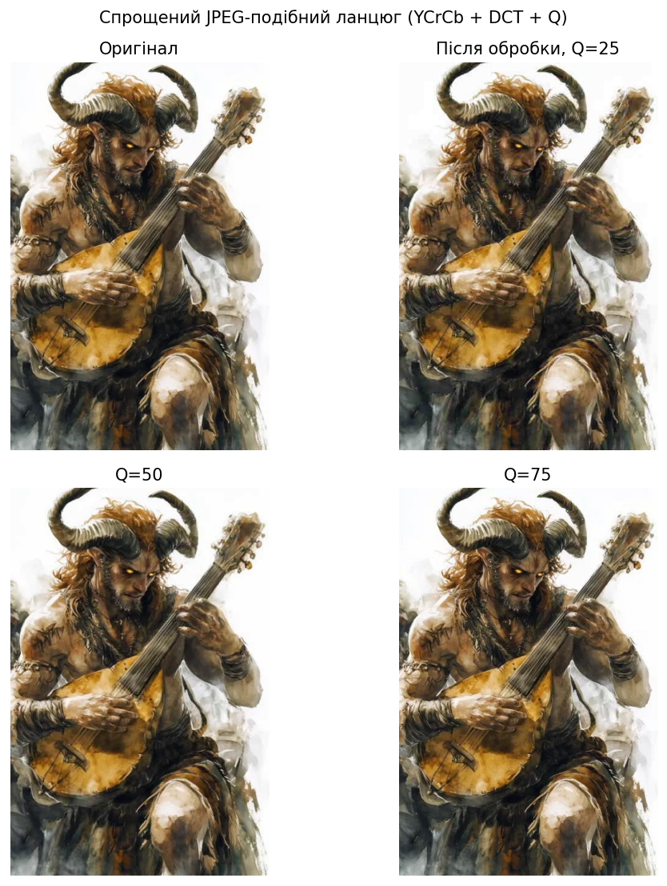
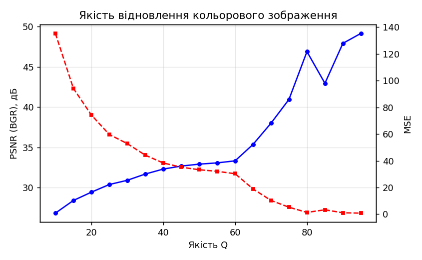

# Лабораторна робота №6

## Тема

Блокова обробка. Реалізація алгоритму JPEG

## Мета роботи

Дослідити принципи блокової обробки цифрових зображень та реалізувати спрощений JPEG-подібний алгоритм стиснення з використанням блоків 8×8, DCT, квантування та відновлення зображення.

## Теоретичні відомості

**Блокова обробка** у JPEG означає, що зображення (після перетворення кольорового простору) розбивають на неперетинні блоки **8×8** пікселів. У кожному блоці незалежно застосовують **2D DCT-II**, що концентрує енергію сигналу в низькочастотних коефіцієнтах.

**Квантування** здійснюють поділом коефіцієнтів DCT на елементи **матриці квантування** з округленням до цілого. Для каналу яскравості **Y** використовують **luma**-таблицю; для **Cr** та **Cb** — зазвичай **chroma**-таблицю з більшими кроками, оскільки око менш чутливе до просторових змін кольору, ніж до яскравості. У повному JPEG додатково застосовують **субдискретизацію** хроми (наприклад, 4:2:0); у спрощеній реалізації лабораторної роботи **Cr** і **Cb** обробляються на **повному розмірі**, як і **Y**.

**Перетворення BGR → YCrCb** відокремлює яскравість від кольорорізниці; після зворотного перетворення **YCrCb → BGR** отримують відновлене кольорове зображення.

**Спрощення відносно повного JPEG:** не реалізовано **зігзаг-сканування**, **RLE** та **ентропійне кодування** (Хаффман / арифметичне); експеримент стосується лише **просторового** етапу: DCT → квантування → де-квантування → IDCT по кожному каналу **Y**, **Cr**, **Cb**.

**Оцінка якості:** **MSE** та **PSNR** обчислюються по всіх трьох каналах BGR після відновлення (середня квадратична помилка по всіх пікселях і каналах).

## Опис виконання

1. Імпортовано `pathlib`, `numpy`, `cv2`, `matplotlib.pyplot`, `scipy.fftpack.dct`, `scipy.fftpack.idct`.
2. Налаштовано `NOTEBOOK_DIR`, `ROOT`, `IMAGE_PATH`, `RESULTS_DIR` для запуску з кореня репозиторію або з `Lab_06`.
3. Реалізовано `imread_color_unicode`, `imwrite_unicode`, допоміжну `bgr_to_rgb` для відображення.
4. Завантажено `satir.jpg` у форматі BGR; збережено `original_color.png`; додатково збережено перегляд оригіналу в RGB (`original_color_display.png`).
5. Виконано `cv2.cvtColor(..., COLOR_BGR2YCrCb)` та `cv2.split`; збережено площини Y, Cr, Cb та їхній колаж `ycrcb_planes_display.png`.
6. Реалізовано `dct2`, `idct2`, масштабування таблиць квантування від параметра **Q**, блокову обробку з доповненням до кратного 8.
7. Для кожного Q з діапазону експерименту відновлено BGR; збережено `reconstructed_bgr_q25.png`, `q50`, `q75`; візуалізація різниці, графік PSNR/MSE, сітка `comparison_color_reconstructions.png`.
8. Перевірка наявності усіх очікуваних файлів у `results/`.

## Результати

Файли у [`Lab_06/results/`](results/):

| Файл | Зміст |
|------|--------|
| `original_color.png` | Оригінал BGR (як у OpenCV) |
| `original_color_display.png` | Оригінал для перегляду (RGB) |
| `plane_Y.png`, `plane_Cr.png`, `plane_Cb.png` | Канали YCrCb |
| `ycrcb_planes_display.png` | Колаж каналів |
| `reconstructed_bgr_q25.png` … `q75.png` | Відновлення при різних Q |
| `difference_bgr_scaled.png` | Масштабована абсолютна різниця BGR |
| `psnr_mse_vs_quality_bgr.png` | PSNR та MSE vs Q |
| `comparison_color_reconstructions.png` | Порівняння 2×2 у RGB |

## Інтерпретація отриманих результатів

При **низькому Q** квантування агресивніше: з’являються **блочні артефакти** на сітці 8×8, змінюються кольори на контурах через спотворення **Cr/Cb**. При **високому Q** відновлення наближається до оригіналу, PSNR зростає, MSE зменшується. Оскільки субдискретизація хроми не використовується, результат ближчий до «JPEG без downsampling хроми», ніж до типового файлу `.jpg` з 4:2:0.

## Висновки

Блокове DCT з різними матрицями квантування для **Y** та **Cr/Cb** відтворює ключову ідею **JPEG** у просторовій області. Повний кодек потребує ще ентропійного кодування серій коефіцієнтів; без нього немає реального бітрейту, але видно залежність візуальної якості та PSNR від **Q**.

## Відповіді на контрольні питання

1. **Навіщо перейти в YCrCb перед DCT?** Щоб окремо обробляти яскравість (найважливішу для ока) та кольорорізницеві канали, до яких можна застосувати сильніше квантування (і в повному стандарті — субдискретизацію).
2. **Чому артефакти часто мають крок 8 пікселів?** Бо квантування виконується **незалежно** в кожному блоці 8×8.
3. **Що дає ентропійне кодування в JPEG порівняно з цією лабораторною?** Воно **стискає бітовий потік** закодованих коефіцієнтів без додаткових втрат (за умови Huffman), тоді як DCT+квантування визначають уже **втратну** частину алгоритму.
